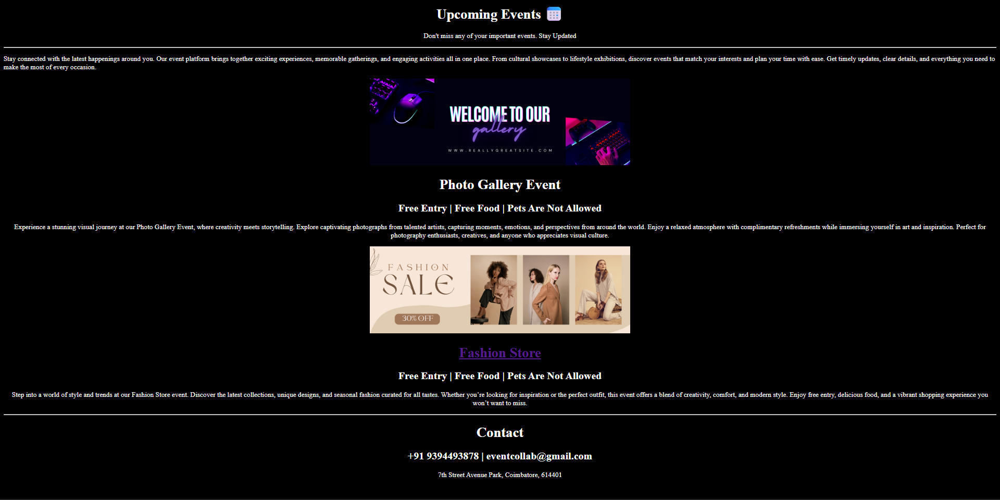

# Upcoming Events Landing Page 📅

A simple HTML-based landing page that displays information about upcoming events.  
This project is created to strengthen foundational HTML skills and webpage structure.


## 🔹 Project Overview

The Upcoming Events Landing Page showcases:
- A header section with event information
- Details about upcoming events
- Event images and descriptions
- External links (Fashion Store)
- Contact information

This project focuses purely on **HTML**, without using CSS frameworks or JavaScript.


## 🛠️ Technologies Used

- HTML5


## 📂 Project Structure

events-page-html/
│
├── event.html
└── img/
      ├── date.png
      ├── event1.png
      └── event2.png


## 🎯 Purpose of This Project

- Practice HTML tags and page layout
- Understand basic webpage structure
- Learn how to organize content for a real-world scenario
- Build confidence in uploading projects to GitHub and LinkedIn


## 🚀 How to Run the Project

1. Clone the repository:
   ```bash
   git clone https://github.com/dinishsg/events-page-html.git
2. Open the event.html file in any web browser.   


## 📸 Screenshots




## 🌐 Live Demo

🔗(https://dinishsg.github.io/events-page-html/event.html)

